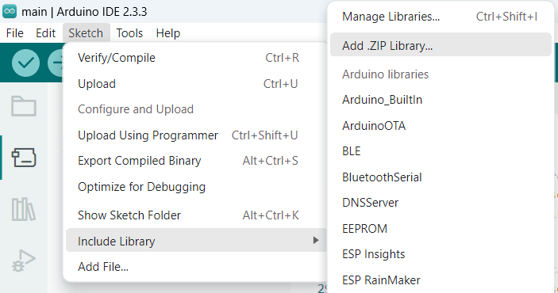

# COMO COLOCAR A BIBLIOTECA NO ARDUINO

1- Compactar a pasta biblioteca_HoCarrinhos para um arquivo zip

2- No arduino IDE 

    2.1- Clicar em sketch 
    2.2- Clicar em Include library
    2.3- Clicar em Add .ZIP library
    2.4- Selecionar a biblioteca zipada

3- Pronto!